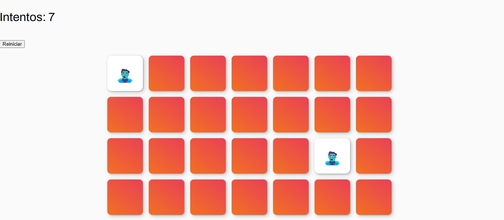

# BIENVENIDOS AL JUEGO DE LA MEMORIA 🤯
*Este es un sencillo proyecto de un juego web donde se deben encontrar las parejas de cartas iguales en la menor cantidad de intentos posibles.*

*El objetivo es coincidir pares de cartas que contienen emojis, cuando hagas clic en una carta, si coinciden, permanecen descubiertas, sino, se vuelven a ocultar.*

## **🤓  INSTALACION  🤓**
1) Clonar este repositorio en tu computadora
2) git clone https://github.com/EduPonce2/Juego-de-la-Memoria.git
3) Asegurate de tener los siguientes archivos en tu carpeta:

index.html

4.css

site.css

script.js

README.md

Abrir el archivo index.html en tu navegador favorito. 

## **🤔 USO 🤔**

Al abrir la página, el juego reparte las cartas de forma aleatoria.

Hacé clic en dos cartas para descubrir su contenido.

Si las cartas coinciden, permanecerán descubiertas.

Si no coinciden, se ocultarán nuevamente después de 1 segundo.

El contador de intentos se actualiza automáticamente.

¡Ganá descubriendo todas las parejas!

**CAPTURA DE PANTALLA**

**CONTRIBUCION🫂**

Toda contribuciones son bienvenidas mientras sea para mejorar este proyecto :)

Se puede hacer de la siguiente forma:

Forkeá el repositorio.

Creá una nueva rama (git checkout -b mejora-nueva).

Hacé tus cambios y hacé commit (git commit -m "Agrega nueva mejora").

Hacé push a la rama (git push origin mejora-nueva).

Abrí un Pull Request para revisión.

## **📞 CONTACTO**

## <u> *AUTORES:* </u>
 
 ### PONCE EDUARDO & AMARILLA FABRICIO

📧 EMAIL: 

eduponce2@gmail.com 
escfabricioamarilla@gmail.com

GITHUB:  

https://github.com/Eduponce2 
 https://github.com/Fabri-amarilla
